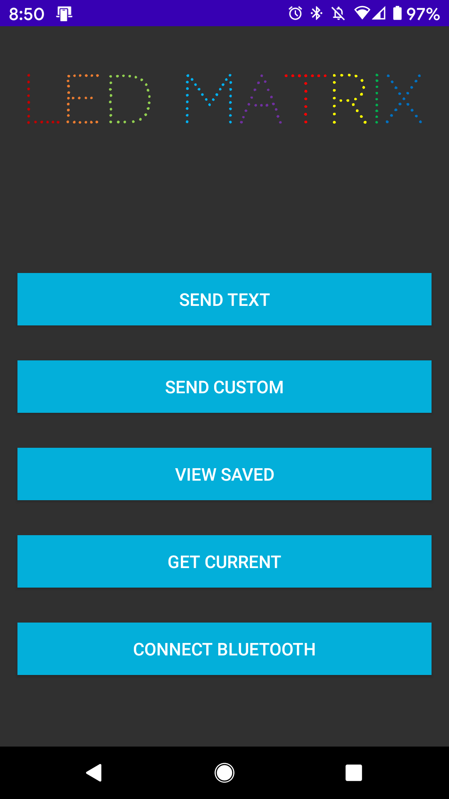
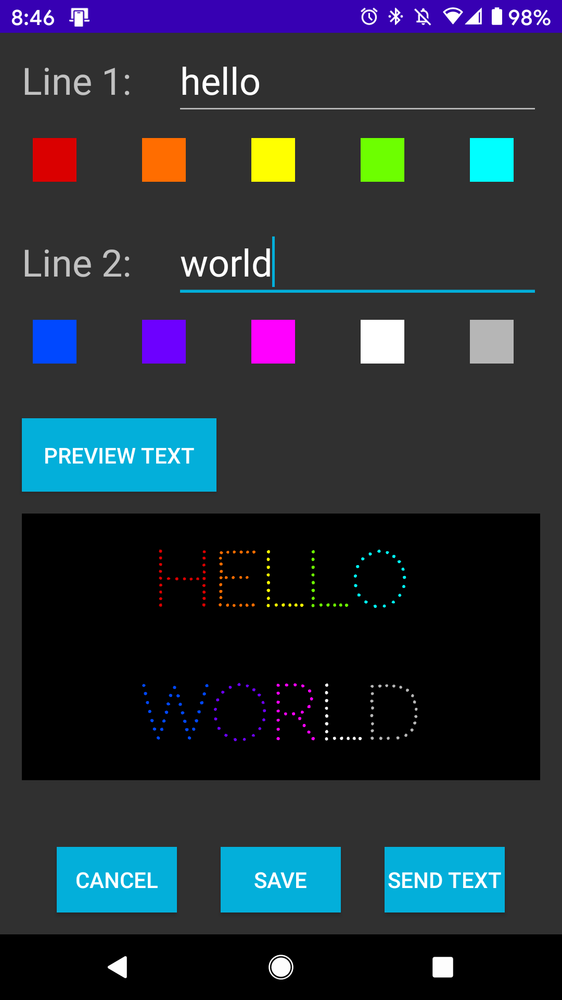
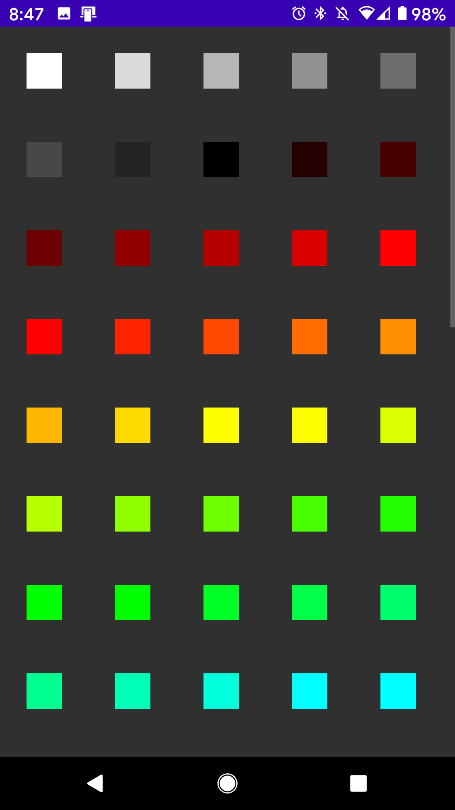
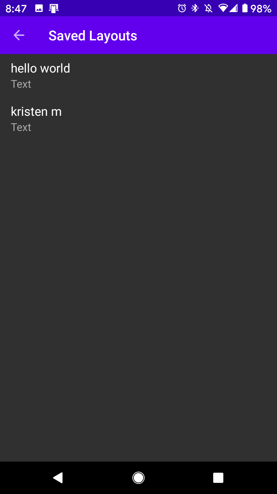

# LED Matrix App
Android app to control Arduino with HC-05 bluetooth module and Adafruit 16x32 led matrix

Main page with options
 

Edit two rows of text, pick colors for each character, and preview the text
 

Save, view, and edit different layouts
 

